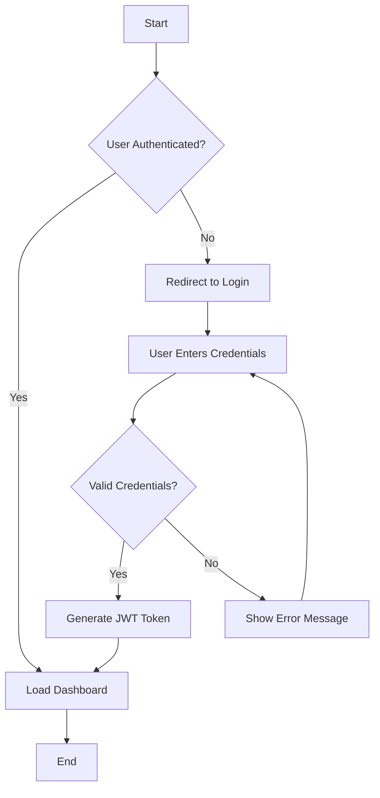

# GitHub Copilot Instructions

## Project Overview
This is a GitHub Copilot development template project showcasing various use cases and development patterns. The project demonstrates how GitHub Copilot can be leveraged across different phases of software development.

## Project Structure
- `backend/` - Backend API services and server-side logic
- `mobile/` - Mobile application development
- `webapp/` - Web application frontend
- `ui-prototype/` - UI prototyping and design components
- `prd/` - Product Requirements Documents and specifications

## GitHub Copilot Use Cases Covered
- Project Estimation and Planning
- Documentation Generation (Project Scope, User Stories)
- User Flow Design
- Gantt Chart Creation
- Test Case Generation
- MVP Prototyping
- Code Review Assistance
- Bug Detection and Edge Case Identification
- Unit Testing
- End-to-End Testing
- Schema Generation

## Development Guidelines

### Code Style and Conventions
- Use clear, descriptive variable and function names
- Follow language-specific best practices and conventions
- Include comprehensive comments for complex logic
- Prioritize readability and maintainability

### Testing Approach
- Write unit tests for all new functions and components
- Include edge case testing scenarios
- Create integration tests for API endpoints
- Implement E2E tests for critical user flows

### Documentation Standards
- Generate clear README files for each module
- Include API documentation with examples
- Document complex algorithms and business logic
- Maintain up-to-date project specifications
- Create Mermaid flow charts for complex features and workflows (see Flow Chart Requirements below)

### Architecture Patterns
- Follow separation of concerns principles
- Use appropriate design patterns for the technology stack
- Implement proper error handling and logging
- Consider scalability and performance implications

## Technology Stack Considerations
- Backend: Node JS, Nest JS, Prisma
- Frontend: React TS with Vite 
- Mobile: React Native With TS Expo
- UI Prototyping: Figma or similar tools
- PRD: Markdown or similar documentation formats
- Database: POSTGRESQL or MongoDB depending on use case
- Testing: Jest, Cypress, or equivalent testing frameworks for Web and For Mobile Automation Use Appium

## Copilot Behavior Guidelines
- Prioritize generating production-ready code
- Include error handling in all generated code
- Suggest relevant test cases when generating functions
- Provide comments explaining complex logic
- Consider security best practices in all suggestions
- Generate code that follows accessibility standards
- Suggest performance optimizations when applicable
- Create Mermaid flow charts when implementing complex features or workflows

## Flow Chart Requirements

### When to Create Flow Charts
Flow charts using Mermaid syntax should be created for:

#### During Scoping Phase:
- User authentication and authorization flows
- Multi-step business processes (e.g., order processing, payment workflows)
- Data transformation pipelines
- Complex decision trees or conditional logic
- Integration workflows between systems
- User onboarding processes
- Error handling and recovery procedures

#### During Code Implementation:
- Functions or methods with complex branching logic
- Asynchronous operations with multiple states
- Database transaction flows
- API request/response cycles with error handling
- State management flows in frontend applications
- Background job processing workflows
- File upload/download processes with validation

### Mermaid Chart Types to Use:
- **Flowchart**: For decision-making processes and general workflows
- **Sequence Diagram**: For API interactions and system communications
- **State Diagram**: For component state management and lifecycle events
- **Journey**: For user experience flows and interactions

### Flow Chart Standards:
- Use clear, descriptive labels for each step
- Include error paths and exception handling
- Show decision points with diamond shapes
- Use consistent naming conventions
- Add comments for complex logic branches
- Include start and end points
- Use appropriate colors and styling for different types of operations

### Example Mermaid Flow Chart:

### Integration with Documentation:
- Include flow charts in README files for complex modules
- Add flow charts to PR descriptions for significant feature implementations
- Reference flow charts in code comments when implementing the described logic
- Update flow charts when modifying existing workflows

## Project-Specific Context
This template serves as a comprehensive example of how GitHub Copilot can enhance the entire software development lifecycle, from initial planning and estimation through development, testing, and deployment. Use this context to provide suggestions that align with best practices in modern software development.
